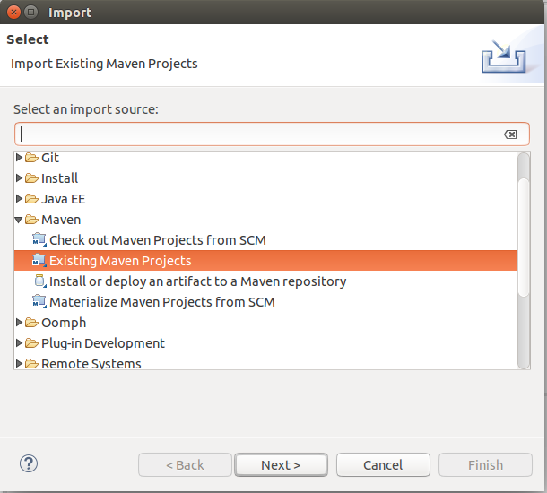
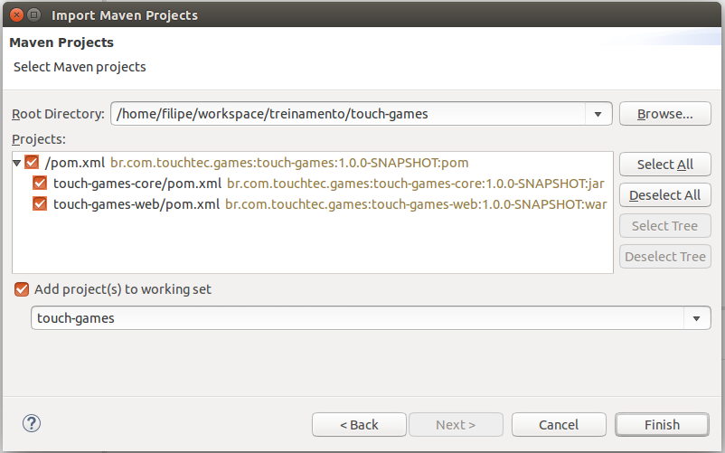

# Ambiente

## Git

Usamos o Git para o versionamento do projeto.

> #### Clonar um projeto git

Vá até a sua pasta de workspace

```
cd ~/workspace
```

:warning: Caso não tenha, crie uma:

```
mkdir ~/workspace
cd ~/workspace
```

Clone o projeto do gerrit ( :bangbang: Trocar $USER pelo seu usuario do gerrit (LDAP) :bangbang: )

```
git clone ssh://$USER@git.touchtec.com.br:29418/touch-games
```


## Eclipse

> #### Importar o projeto no Eclipse


File → Import|Indo em Browse... Selecione a pasta raiz do projeto.
-------------|----------------------------------------------------
|


> #### Criar um server

Siga os passos da pagina:
[Configurando o WTP plugin com um Tomcat](http://confluence.touchtec.com.br/display/AMBDEV/Configurando+o+WTP+plugin+com+um+Tomcat)

## Banco

Utilizaremos o Postgres como banco de dados da aplicação.

> #### Instalar o postgresql

```
sudo apt-get install postgresql
```

Para continuarmos, precisamos logar com o usuário do postgres. Basta executar o comando abaixo:

```
sudo su - postgres
```

> #### Criar um usuario no postgres

```
createuser -s -d -r -l -i -P touch
```


> #### Criar um database

```
createdb -E utf8 -O touch -e touch-games
```

Comandos utéis:

> #### Adicionar arquivo no stage

Abra o arquivo index.jsp (touch-games-web/src/main/webapp/index.jsp)
Edite conforme abaixo:

```html
<jsp:directive.page language="java" contentType="text/html; charset=UTF-8" pageEncoding="UTF-8" />
    <!-- <c:redirect url="/Compras.action"/> -->
    Eu sou um teste!
</jsp:root>
```

Salve, e no terminal, execute o comando abaixo:

```
git status
```

Esse comando mostrará que atualizamos o arquivo index.jsp
Para adicionar ao stage, rode o comando abaixo:

```
git add -A
```

> #### Commit no repositorio local

Para salvar suas alterações no repositorio local, use o comando abaixo

```
git commit -m "comentario"
```

Pronto! Suas alterações estão salvas no seu repositorio local.
Por motivo de segurança, não vamos mandar para o repositorio remoto.

---
:books: Material de apoio

* [Treinamento básico da Touch de Git](http://confluence.touchtec.com.br/display/AMBDEV/Git)
* [Treinamento mão na massa de Git (recomendado)](http://confluence.touchtec.com.br/pages/viewpage.action?pageId=234295302)
* [Básico do Git no Code School](https://www.codeschool.com/courses/try-git)
---

# Maven

O maven irá nos ajudar no gerenciamento de dependencias e na construção da aplicação.
O nosso projeto terá a seguinte estrutura maven:
* **touch-games** é nosso projeto maven;
    * **touch-games-core** é um modulo do nosso projeto, nele temos o modelo, serviços e DTO's.
    * **touch-games-web** é um modulo também e nossa aplicação final. Nele temos serviços relacionados a web.

---
:books: Material de apoio

[Referencia Touch Maven](http://confluence.touchtec.com.br/display/AMBDEV/Maven)

---


[Next](JAVA.md)

[Índice](index.md)
