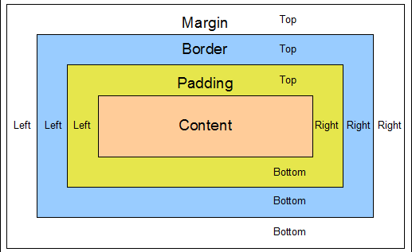

# Tela de Compras

Está na hora de criarmos o esqueleto do nosso e-commerce: a tela de Compras.

# Tag File

Para reaproveitar melhor nosos código, vamos usar uma ferramenta chamada **Tag Files**.
Tag Files são arquivos JSP reaproveitáveis e que podem ser usados como se fossem uma **Tag Lib**.
A diferença básica é que Tag Files são apenas arquivos (.tag). Já Tag Libs possuem uma classe Java por trás (Tag).

Nossa tag file vai renderizar o esqueleto do nosos site:


> #### Complete o `body` do aquivo `WEB-INF/tags/screen.tag`
> `WEB-INF/lib` é o diretório padrão para criarmos tag files

```html
<div id="screen">
    <div id="header">
        <jsp:include page="/WEB-INF/tags/header.jsp"/>

    </div>

    <div id="top-navigation">
        <jsp:include page="/WEB-INF/tags/menu_plataformas.jsp"/>
    </div>

    <%--
    COTEUDO PASSADO NO CORPO DA TAG
    --%>
    <div id="center">
        <jsp:doBody/>
    </div>

    <div id="footer">
        <jsp:include page="/WEB-INF/tags/footer.jsp"/>
    </div>
</div>
```

> #### Complete também `WEB-INF/tags/menu_plataformas.jsp`
> De onde vem `${todasPlataformas}`? Veremos adiante.
> Veja que `menu_plataformas.jsp` é diferente dos demais jsps que vimos até aqui.
> É apenas um outro tipo de sintaxe. São equivalentes.

```html
<ul id="menu-plataformas" class="clearfix">
	<c:forEach items="${todasPlataformas}" var="plataforma">
		<li>
			<a href="${app}/Compras!jogosPorPlataforma.action?plataformaSelecionada.id=${plataforma.id}">${plataforma.nome}</a>
		</li>
	</c:forEach>
</ul>
```


> #### Reinicie a aplicação e acesse
> [/Compras.action]()
> Não está muito bonita nossa tela...


# CSS

[Referencia](http://www.w3schools.com/cssref/css_selectors.asp	)

CSS adiciona estilos visuais ao HTML
- HTML → estrutura
- CSS → estilos
- Javascript → comportamento

```
#header {
	height: 90px;
	background: #005680 url('../img/bg-header.jpg');
}

/* comentário css */

- #header: seletor
- height, background:  propriedades
```

## Principais seletores

- **id:** #header { … }
- **class:** .game-box { … }
- **elemento:** div { … }, * { … }
- **descendente:** #center .game-box { … }
- **filho:** #center > .game-box { … }
- **atributo:** [value=30] { … }, [value]  { … }
- **OU:** #header, #footer { … }
- **E:** div.game-box { …}, #input[value=42] { … }

## Dimensões

- **width:** largura. 30px, 100%
- **height:** altura
- **margin**
- **border**
- **padding**



## Cores e Fontes

- **background:** cor, imagem de fundo
- **color:** cor do texto
- **font-size:** tamanho do texto

## Float

Faz um elemento _flutuar_
- **left:** flutua à esquerda
- **right:** flutua à direita
- **clear:** especifica que um elemento não pode flutuar sobre ele

> #### Acesse a página de exemplo: [/examples/float.html]()

## Display

Informa se um elemento deve ser **exibido** e **como**.

- **block:** inicia em um nova linha e ocupa 100% da largura
- **inline:** não quebra linha e ocupa apenas a alrgura necessária
- **none:** esconde um elemento
- **inline-block:** iguais aos inline, mas podem ter altura e largura

> #### Veja exemplos: [https://www.w3schools.com/css/css_display_visibility.asp]()

## Position

Posiciona elementos na tela

- **static:** estático em relação a _top_, _bottom_, _left_ e _right_. Padrão.
- **relative:** relativo à sua posição normal (static)
- **absolute:** relativo ao seu ancestral posicionado mais próximo
- **fixed:** relativo ao _viewport_ (área que o usuário esta vendo). Não muda de posição com o _scroll_.

> #### Veja exemplos: [https://www.w3schools.com/css/css_positioning.asp]()

## Pseudo classes

- **:hover:** quando o mouse passar sobre o elmento
- **:focus:** quando o foco estiver no elemento
- **:first-child:** quando o elemento estiver na primeira posiçao entre os filhos
- **:visited:** quando o link foi visitado (clicado)

```
.game:hover {
	text-decoration: underline;
}
```

# Adicionando estilos à nossa tela

> #### Adicione `games.css` no header de `WEB-INF/tags/screen.tag`

```html
<head>
    <title>Touch Games - Um toque de diversão</title>

    <link href="${app}/css/games.css" rel="stylesheet"/>
</head>
```

> #### Acesse [/Compras.action]()
> Veja que a tela já está melhor, mas ainda precisamos corrigir algumas coisas

### Cabeçalho

> #### Em `games.css`, encontre a descomente regra `#header {}`
> Recarregue a tela

Repare que definimos para **#header**:
- background image
- height
- padding

> #### Descomente `.left {}` e `.right {`
> Serão afetados o logo Touch Games a caixa de Busca à direita
> Recarregue a tela

Repare que definimos a propriedade **float**

### Menu Plataformas

> #### Encontre e descomente a regra `#menu-plataformas li {}`
> Recarregue a tela

clear

> #### Encontre e decomente e regra `.clearfix:after{}`
> Recarregue a tela
> Repare no menu plataformas

### Rodapé

Queremos que o rodapé fica preso no pé da página

> #### Encontre e decomente a regra `#footer {}`
> Recarregue a tela
> Dê um scroll na tela. Repare que o rodapé não acompanha

Faltou uma coisa:

> #### Encontre a regra `#screen {}` e descomente **position**]
> Recarregue a tela
> Dê um scroll na tela. Agora sim.


