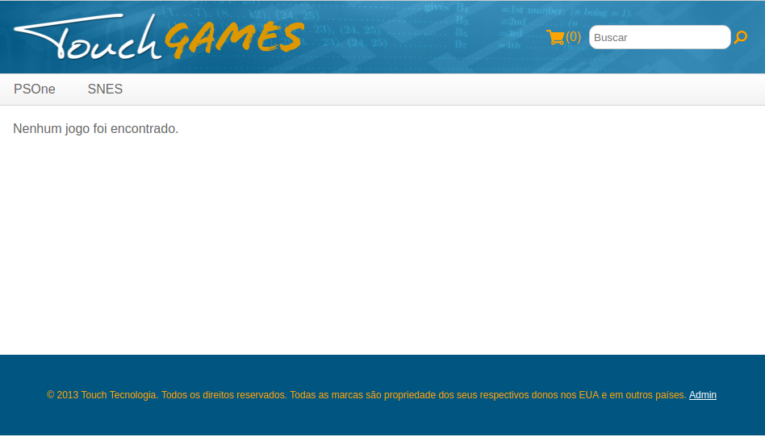

# Tela de Compras

Está na hora de criarmos o esqueleto do nosso e-commerce: a tela de Compras.

# Tag File

Para reaproveitar melhor nosos código, vamos usar uma ferramenta chamada **Tag Files**.
Tag Files são arquivos JSP reaproveitáveis e que podem ser usados como se fossem uma **Tag Lib**.
A diferença básica é que Tag Files são apenas arquivos (.tag). Já Tag Libs possuem uma classe Java por trás (Tag).

Nossa tag file vai renderizar o esqueleto do nosos site:

