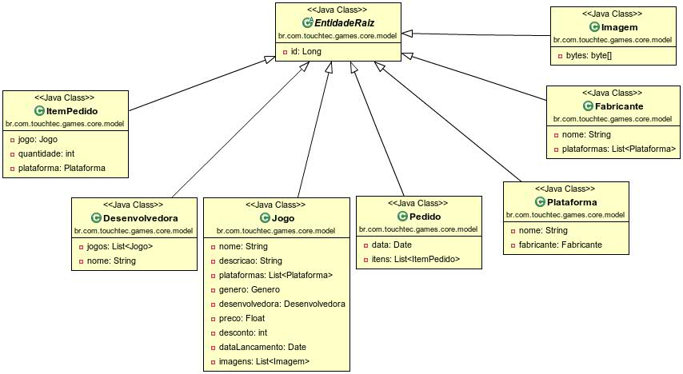

# JPA

JPA é uma _especificação_ que nos permite trabalhar com objetos para acessar **Banco de Dados**.  
Com ela, praticamente não precisamos executar código **SQL**.  
A _implementação_ mais popular é o **Hibernate**.

# O Modelo UML do nosso e commerce




## @Entity

Define uma Entidade. Entidades equivalem às Tabelas de um banco.

> #### Abra a classe `Jogo` e adicione
> `@Table` é opcional. Sem ela, o **Hibernate** usa o nome da entidade para criar a tabela.

```java
@Entity
@Table(name = "jogos")
public class Jogo extends EntidadeRaiz {
...
```

## @MappedSuperclass

Usada em classes que serão estendidas por entidades.  
Não será criada uma tabela para elas.

> #### Anote `EntidadeRaiz` com `@MappedSupeclass`

```java
@MappedSuperclass
public abstract class EntidadeRaiz implements Serializable {
...
```

## @Id
Especifica a chave primária (PK) da Entidade.  
Todas as nossas entidades estendem `EntidadeRaiz`. A PK está definida nela.

> #### Abra `EntidadeRaiz` e anote a propriedade id
> Tanto faz anotar o getter ou o setter 
> Usamos também `@GeneratedValue` para que o o seja gerado automaticamente pelo **Hibernate**.

```java
@Id
@GeneratedValue(strategy = GenerationType.SEQUENCE)
public Long getId() {
    return this.id;
}
```

## @Column
Usamos para mudar o nome padrão da coluna da tabela.  
Usamos também para especificar **constraints**.

> #### Abra a classe `Jogo` e anote a propriedade `nome`

```java
@Column(name = "nome_do_jogo", unique = true)
public String getNome() {
...
```

## @Transient
Usamos para marcar uma propriedade como **não persistente**, que não é salva no banco.  
Comum para valores calculados.

> #### Na classe `Jogo`, marque a propriedade `precoComDesconto` com `@Transient`

```java
@Transient
public Float getPrecoComDesconto() {
...
```

## @Lob

Lobs são _Large Objects_, um tipo especial de dado.  
Arquivos binários são mapeados como Lob.

> #### Abra a classe `Imagem` e anote a propriedade `bytes`

```java
@Lob
public byte[] getBytes() {
...
```


# Relacionamentos

Relacionamentos são associações entre **entidades**.  
No banco, eles se tornam **JOINs** entre tabelas. 

Usaremos sempre a entidade `Jogo` nos exercícios a seguir.

## @ManyToMany

> #### Anote `plataformas`
> Uma Plataforma possui vários Jogos; um jogo pode ser de várias plataformas.  
> `@OrderBy` serve para carregar os valores em ordem.

```java
@ManyToMany
@OrderBy("nome")
public List<Plataforma> getPlataformas() {
...
```

## @ManyToOne

> #### Anote `desenvolvedora`
> Uma Desenvolvedora cria vários jogos; um Jogo é criado por uma Desenvolvedora (para simplificar).

```java
@ManyToOne
public Desenvolvedora getDesenvolvedora() {
...
```

## @OneToMany

> #### Anote `imagens`
> Um Jogo possui várias Imagens; uma Imagem pertence a um Jogo.  
> **Cascade:** ao criar um Jogo, cria também a imagem. ALL vale para edição e remoção também.   
> **fetch:** ao carregar um Jogo, devo carregar as imagens também?  
> **orphanRemoval:** ao remover uma entidade da lista de imagens (e deixá-la órfã), devo removê-la do banco? 

```java
@OneToMany(cascade = CascadeType.ALL, fetch = FetchType.EAGER, orphanRemoval = true)
public List<Imagem> getImagens() {
...
```

## mappedBy

Sempre que tivermos um relacionamento **bidirecional**, devemos marcar o _lado fraco_ com **mappedBy**.  
O lado fraco é lado que não tem a coluna no banco. Normalmente o lado many.  
O **mappedBy** é importanto para que o Hibernate saiba como fazer o **JOIN**.
 
> #### Abra a entidade `Desenvolvedora` e anote `jogos`
> Repare que `Desenvolvedora` mapeia `Jogo` e vice-versa.

```java
@OneToMany(mappedBy = "desenvolvedora")
public List<Jogo> getJogos() {
    return this.jogos;
}
```

---

As demais entidades já estão mapeadas.


## Entity Manager

O Entity Manager é o gerenciador das entidades: remove, cria, edita e atualiza (CRUD).  
A configuração dele é feita no persistence.xml.

> #### Abra o `persistence.xml` para analisarmos

### EntityManagerFactory

Para criarmos um `EntityManager`, usamos um `EntityManagerFactory`
 
> #### Abra `DesenvolvedoraServiceImpl` e adicione
> Repare que **touch-games** é o nome do **persistece unit** definido no `persistcen.xml`  
> Por que usamos `static final`?

```java
public class DesenvolvedoraServiceImpl implements DesenvolvedoraService {

    private static final EntityManagerFactory EMF = Persistence.createEntityManagerFactory("touch-games");
    
...
```
 


## Transação

Uma transação é uma operação atômica.

```java
this.em.getTransaction().begin();

// executa várias tarefas; se uma falhar, a operação toda deve ser abortada 

this.em.getTransaction().commit();
```

## Service

Services guardam as regras de negócio da aplicação.  
São a camada de Controle do modelo MVC.  
Em geral, criamos interfaces para reduzir o acoplamento entre os módulos.

```java
public interface DesenvolvedoraService {

    void criar(Desenvolvedora desenvolvedora);

    void remover(Desenvolvedora desenvolvedora);

    void editar(Desenvolvedora desenvolvedora);

    Desenvolvedora recuperar(Long id);

    List<Desenvolvedora> buscarTodos();
}
```


> #### Implemente os métodos do serviço `DesenvolvedoraServiceImpl`

```java
@Override
public void criar(Desenvolvedora desenvolvedora) {
    EntityManager em = EMF.createEntityManager();

    em.getTransaction().begin();
    em.persist(desenvolvedora);
    em.getTransaction().commit();
}
```

```java
@Override
public void remover(Desenvolvedora desenvolvedora) {
    EntityManager em = EMF.createEntityManager();

    Desenvolvedora connectedEntity = em.find(Desenvolvedora.class, desenvolvedora.getId());
    if (connectedEntity == null) {
        return;
    }

    em.getTransaction().begin();
    em.remove(connectedEntity);
    em.getTransaction().commit();
}
```

```java
@Override
public void editar(Desenvolvedora desenvolvedora) {
    EntityManager em = EMF.createEntityManager();

    em.getTransaction().begin();
    em.merge(desenvolvedora);
    em.getTransaction().commit();
}
```

```java
@Override
public Desenvolvedora recuperar(Long id) {
    // Não é necessário transação. Nunca?

    EntityManager em = EMF.createEntityManager();

    Desenvolvedora desenvolvedora = em.find(Desenvolvedora.class, id);
    return desenvolvedora;
}
```

```java
@Override
public List<Desenvolvedora> buscarTodos() {
    EntityManager em = EMF.createEntityManager();

    String queryString = "SELECT d FROM Desenvolvedora d ORDER BY d.nome";
    Query query = em.createQuery(queryString);
    List<Desenvolvedora> desenvolvedoras = QueryTyper.getResultList(query);
    return desenvolvedoras;
}
```

## Um pouco mais sobre Queries

> #### Abra `JogoServiceImpl` e implemente `buscar(String nome)`
> Busca por LIKE  
> Transção necessária porque **imagens** é um Lob

```java
@Override
public List<Jogo> buscar(String nome) {
    EntityManager em = EMF.createEntityManager();

    String queryString = "SELECT j FROM Jogo j WHERE UPPER( j.nome) LIKE UPPER(:nome) ORDER BY j.nome";
    Query query = em.createQuery(queryString);
    String nomebusca = nome == null ? "" : nome;
    query.setParameter("nome", "%" + nomebusca + "%");

    em.getTransaction().begin();
    List<Jogo> jogos = QueryTyper.getResultList(query);
    em.getTransaction().commit();

    return jogos;
}
```

> #### Implemente `buscar(Plataforma plataforma)`
> Ao buscar por um relacionamento, é preciso carregá-lo antes

```java
@Override
public List<Jogo> buscar(Plataforma plataforma) {
    EntityManager em = EMF.createEntityManager();

    String queryString = "SELECT j FROM Jogo j WHERE :plataforma MEMBER OF j.plataformas ORDER BY j.nome";
    Query query = em.createQuery(queryString);

    Plataforma plataformaConectada = em.find(Plataforma.class, plataforma.getId());
    query.setParameter("plataforma", plataformaConectada);

    em.getTransaction().begin();
    List<Jogo> jogos = QueryTyper.getResultList(query);
    em.getTransaction().commit();

    return jogos;
}
```


