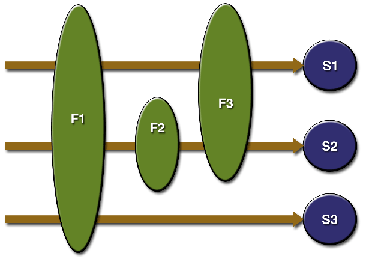

# Servlets

Servlets são classes que respondem a uma chamada HTTP.  
Elas recebem uma request e devolvem uma response.  
Uma response pode ser uma página HTML, um arquivo para download ou um arquivo CSS/JS.

> #### Adicione o código abaixo à classe `HelloServlet`

```java
@Override
protected void doGet(HttpServletRequest request, HttpServletResponse response) throws ServletException, IOException {
    // Parâmetros são passados pela url após o sinal de "?"
    // Múltiplos parâmetros são separados por "&"

    // hello?nome=Touch&sobrenome=Tecnologia

    String nome = request.getParameter("nome");
    String sobrenome = request.getParameter("sobrenome");

    String pagina = "" +
            "<html>" +
            "<head>" +
            "<title>Servlets</title>" +
            "</head>" +
            "<body>" +
            "<div>Olá, " + nome + sobrenome + "</div>" +
            "</body>" +
            "</html>";

    response.getWriter().write(pagina);
}
```

> #### Abra o arquivo `web.xml` e adicione o mapeameno abaixo

```xml
<!-- Declaração da servlet-->
<servlet>
   <servlet-name>hello</servlet-name>
   <servlet-class>br.com.touchtec.games.web.servlet.HelloServlet</servlet-class>
</servlet>

<!-- Mapeamento. Quais requests ela vai atender?-->
<servlet-mapping>
   <servlet-name>hello</servlet-name>
   <url-pattern>/hello</url-pattern>
</servlet-mapping>
```

> #### Suba a aplicação e acesse
> [/hello?nome=SEU_NOME&sobrenome_SEU_SOBRENOME]()

# JSP (Java Server Pages)

Usamos JSPs para não termos que escrever código HTML no Java.

> #### Adicione o código abaixo à classe `HelloJSPServlet`

```java
@Override
protected void doGet(HttpServletRequest request, HttpServletResponse response) throws ServletException, IOException {
    request.setAttribute("serverTime", new Date());

    // Em vez de escrever o código HTML diretamente na response, delegamos a tarefa a um JSP
    request.getRequestDispatcher("/jsp/servlet/result.jsp").forward(request, response);
}
```

> #### Em vez de mapearmos via `web.xml`, vamos fazer via anotações

```java
// A partir da servlet 3.0 é possível usar anotações em vez de mapear no web.xml
@WebServlet(urlPatterns = "/hellojsp")
public class HelloJSPServlet extends HttpServlet {
...
```

> #### Adicione o código abaixo ao arquivo `jsp/servlet/result.jsp`

```html
<html>
    <head>
       <meta http-equiv="Content-Type" content="text/html; charset=UTF-8" />
       <title>Servlets e JSPs</title>
    </head>

    <body>

       <p>
          JSPs são capazes de gerar HTML dinamicos; não apenas HTML, é verdade;
       </p>
       <p>
          Por ex, sou capaz de imprimir a hora atual do servidor: ${serverTime} <a href="">Atualizar</a>
       </p>
       <p>
          E este aqui é o seu context path (o caminho da sua aplicação): ${app}
       </p>

       <!--
       [É bom saber:]
       JSPs são compilados pelo servidor (Tomcat) e se transformam em uma Servlet.
       -->
    </body>
</html>
```

> #### Reinicie a aplicação e acesse
> [/hellojsp]()

# Filters

Filtros servem para compartilhar recursos com as servlets.



> #### Abra a classe `ContextPathFilter` e implemente o método `doFilter()`

```java
HttpServletRequest httpRequest = (HttpServletRequest) request;
httpRequest.setAttribute("app", httpRequest.getContextPath());

chain.doFilter(request, response);
```

> #### Abra `web.xml` e mapeie o filtro antes dos demais
> A ordem dos filtros importa. Nosso filtro precisa ser o primeiro.

```xml
<filter>
    <filter-name>ctxPath</filter-name>
    <filter-class>br.com.touchtec.games.web.servlet.ContextPathFilter</filter-class>
</filter>
<filter-mapping>
    <filter-name>ctxPath</filter-name>
    <url-pattern>/*</url-pattern>
</filter-mapping>
```

> #### Acesse novamente [/hellojsp]() e observe o valor do context path


# JogosServlet

Finalmente vamos fazer a primeira tela do nosso e-commerce.  
Antes, um pouco sobre **HTTP**:

```
[GET]
TELA INICIAL: jogos/
TELA CRIAÇÃO: jogos/create
TELA EDIÇÃO: jogos/update?id=42

[POST]
CRIAR: jogos?method=savenew
ATUALIZAR: jogos?method=save
REMOVER: jogos?method=remove

```

> #### Abra `JogosServlet` e adicione o mapeamento

```java
@WebServlet(urlPatterns = "/jogos/*")
public class JogosServlet extends HttpServlet {
...
```

> #### Adicione as dependências aos serviços

```java
private JogoService jogoService = new JogoServiceImpl();

private DesenvolvedoraService desenvolvedoraService = new DesenvolvedoraServiceImpl();
```

> #### Implemente o `doGet()` (operações que nao modificam o estado da aplicação)

- tela inicial: LISTA
- tela de edição: UPDATE

```java
/**
 * [GET]
 * De uma maneira simplificada, é usado para operações que NAO modificam o estado da aplicação.
 * Que sao idempotentes. Você pode chamar várias vezes e a resposta será a mesma.
 */
@Override
protected void doGet(HttpServletRequest req, HttpServletResponse resp) throws ServletException, IOException {
    String method = getMethod(req);
    req.setAttribute("method", method);

    // Para os selects
    List<Desenvolvedora> desenvolvedoras = desenvolvedoraService.buscarTodos();
    req.setAttribute("desenvolvedoras", desenvolvedoras);
    req.setAttribute("generos", Genero.values());

    if ("update".equals(method)) {
        Long selectedId = Long.parseLong(req.getParameter("id"));
        Jogo jogo = jogoService.recuperar(selectedId);
        req.setAttribute("jogo", jogo);
    }

    // Lista de jogos para a tabela
    List<Jogo> jogos = jogoService.buscarTodos();
    req.setAttribute("jogos", jogos);

    req.getRequestDispatcher("/jsp/servlet/jogos.jsp").forward(req, resp);
}

// /jogos/create => "create", pega o último texto depois da "/"
private static String getMethod(HttpServletRequest req) {
    String[] parts = req.getRequestURI().split("/");
    return parts[parts.length - 1];
}
```

> ####  Abra `jsp/servlet/jogos.jsp` e adicone o código abaixo dentro da tag `body`

- tags HTML
- forms, name, elementos de input
- c:forEach
- c:fmt
- operador `${}`

```html
<a href="${app}/jogos/create">Adicionar</a>

<table>
    <thead>
        <tr>
            <th>Nome</th>
            <th>Gênero</th>
            <th>Desenvolvedora</th>
            <th>Preço</th>
            <th>Preço com Desconto</th>
            <th>Data de Lançamento</th>
            <th>Ações</th></tr>
    </thead>
    <tbody>
    <c:forEach items="${jogos}" var="jogo">
        <tr>
            <td>${jogo.nome}</td>
            <td>${jogo.genero}</td>
            <td>${jogo.desenvolvedora}</td>
            <td>${jogo.preco}</td>
            <td>${jogo.precoComDesconto}</td>
            <td>
                <fmt:formatDate value="${jogo.dataLancamento}" var="dataLancamento" dateStyle="SHORT" />
                ${dataLancamento}
            </td>
            <td>
                <a href="${app}/jogos/update?id=${jogo.id}">Editar</a>
            </td>
        </tr>
    </c:forEach>
    </tbody>
</table>

<c:if test="${method=='create'}">
    <form action="${app}/jogos" method="post">
        <fieldset>
            <legend>Novo Jogo</legend>

            <div>
                <div>Nome:</div>
                <input type="text" name="nome"/>
            </div>
            <div>
                <div>Descrição:</div>
                <textarea name="descricao" rows="5" cols="30"><!-- vazio --></textarea>
            </div>
            <div>
                <div>Desenvolvedora:</div>
                <select name="desenvolvedora">
                    <option></option>
                    <c:forEach items="${desenvolvedoras}" var="desenvolvedora">
                        <option value="${desenvolvedora.id}">${desenvolvedora.nome}</option>
                    </c:forEach>
                </select>
            </div>
            <div>
                <div>Gênero:</div>
                <c:forEach items="${generos}" var="genero">
                    <input type="radio" name="genero" value="${genero}" >${genero}</input>
                </c:forEach>
            </div>
            <div>
                <div>Data de Lançamento:</div>
                <input  type="date" name="dataLancamento"/>
            </div>
            <div>
                <div>Preço:</div>
                <input  type="number" name="preco" step="0.01"/>
            </div>
            <div>
                <div>Desconto:</div>
                <input  type="number" name="desconto"/>%
            </div>

            <div>
                <button type="submit" name="method" value="savenew">Criar</button>
                <a href="${app}/jogos">Cancelar</a>
            </div>
        </fieldset>
    </form>
</c:if>
```

> #### Reinicie a aplicação e acesse
> [/jogos]()
> Crie alguns jogos e obeserve-os na tabela

---

> ####  Implemente o método doPost (operações que alteram o estado da aplicação)

- operação de REMOCAO
- operação de SALVAR
- operação de CRIAR

```java
/**
 * [POST]
 * É usado para operações que modificam o estado da aplicação.
 * Que NAO sao idempotentes. Cada vez que vc chama, a resposta pode variar.
 */
@Override
protected void doPost(HttpServletRequest request, HttpServletResponse response) throws ServletException, IOException {
    // Enviado pelos botoes de submit
    String method = request.getParameter("method");

    if ("remove".equals(method)) {
        Jogo jogo = recuperarJogo(request);
        jogoService.remover(jogo);
    } else if ("save".equals(method)) {
        Jogo jogo = recuperarJogo(request);
        preencheJogo(request, jogo);
        jogoService.editar(jogo);
    } else if ("savenew".equals(method)) {
        Jogo jogo = new Jogo();
        preencheJogo(request, jogo);
        jogoService.criar(jogo);
    }

    // Lista de jogos para a tabela
    List<Jogo> jogos = jogoService.buscarTodos();
    request.setAttribute("jogos", jogos);

    request.getRequestDispatcher("/jsp/servlet/jogos.jsp").forward(request, response);
}


private Jogo recuperarJogo(HttpServletRequest request) {
    String id = request.getParameter("id");
    if (isNullOrEmpty(id)) {
        throw new IllegalArgumentException("Id nulo");
    }
    Jogo jogo = jogoService.recuperar(Long.parseLong(id));
    return jogo;
}
```

> #### Adicione o método de conversão Request → Jogo
> Observe como é feita a conversão de cada tipo

```java
/**
 * Preenche um Jogo com dados da request.
 * HTTP é um protocolo de texto: HyperText Transfer Protocol.
 * Por isso, precisamos converter os textos para os tipos que desejamos.
 */
private void preencheJogo(HttpServletRequest request, Jogo jogo) {
    // STRING, não precisa de conversão

    jogo.setNome(request.getParameter("nome"));

    jogo.setDescricao(request.getParameter("descricao"));

    // ENUM

    String genero = request.getParameter("genero");
    if (isNullOrEmpty(genero)) {
        jogo.setGenero(null);
    } else {
        jogo.setGenero(Genero.valueOf(genero));
    }

    // DATA

    String dataLancamento = request.getParameter("dataLancamento");
    if (isNullOrEmpty(dataLancamento)) {
        jogo.setDataLancamento(null);
    } else {
        try {
            SimpleDateFormat dateFormat = new SimpleDateFormat("yyyy-MM-dd");
            jogo.setDataLancamento(dateFormat.parse(dataLancamento));
        } catch (ParseException e) {
            throw new RuntimeException(e);
        }
    }

    // FLOAT

    String preco = request.getParameter("preco");
    if (isNullOrEmpty(preco)) {
        jogo.setPreco(null);
    } else {
        jogo.setPreco(Float.parseFloat(preco));
    }

    // INTEGER

    String desconto = request.getParameter("desconto");
    if (isNullOrEmpty(desconto)) {
        jogo.setDesconto(0);
    } else {
        jogo.setDesconto(Integer.parseInt(desconto));
    }

    // ASSOCIACAO

    String desenvolvedoraId = request.getParameter("desenvolvedora");
    if (isNullOrEmpty(desenvolvedoraId)) {
        jogo.setDesenvolvedora(null);
    } else {
        Long id = Long.parseLong(desenvolvedoraId);
        jogo.setDesenvolvedora(desenvolvedoraService.recuperar(id));
    }
}
```

> #### Abra `jsp/servlet/jogos.jsp` e adicone o código da edição/remoção logo abaixo do do anterior

```html
<c:if test="${method=='update'}">
    <form action="${app}/jogos" method="post">
        <fieldset>
            <legend>Editando ${jogo.nome}</legend>
            
            <input type="hidden" name="id" value="${jogo.id}" />
            
            <div>
                <div>Nome:</div>
                <input type="text" name="nome" value="${jogo.nome}"/>
            </div>        
            <div>
                <div>Descrição:</div>
                <textarea type="text" name="descricao" rows="5" cols="30">${jogo.descricao}</textarea>
            </div>
            <div>
                <div>Desenvolvedora:</div>
                <select name="desenvolvedora">
                    <c:if test="${not empty jogo.desenvolvedora}">
                        <option value=""></option>
                    </c:if>
                    <c:if test="${empty jogo.desenvolvedora}">
                        <option value="" selected=""></option>
                    </c:if>
                
                    <c:forEach items="${desenvolvedoras}" var="desenvolvedora">
                        <c:if test="${jogo.desenvolvedora!=desenvolvedora}">
                            <option value="${desenvolvedora.id}">${desenvolvedora.nome}</option>
                        </c:if>
                        <c:if test="${jogo.desenvolvedora==desenvolvedora}">
                            <option value="${desenvolvedora.id}" selected="">${desenvolvedora.nome}</option>
                        </c:if>
                    </c:forEach>
                </select>
            </div>
            <div>
                <div>Gênero:</div>
                <c:forEach items="${generos}" var="genero">
                    <c:if test="${jogo.genero!=genero}">
                        <input type="radio" name="genero" value="${genero}" >${genero}</input>
                    </c:if>
                    <c:if test="${jogo.genero==genero}">
                        <input type="radio" name="genero" value="${genero}" checked="">${genero}</input>
                    </c:if>
                </c:forEach>
            </div>
            <div>
                <div>Data de Lançamento:</div>
                <fmt:formatDate value="${jogo.dataLancamento}" var="dataLancamento" dateStyle="SHORT" />
                <input  type="date" name="dataLancamento" value="${dataLancamento}"/>
            </div>
            <div>
                <div>Preço:</div>
                <input  type="number" name="preco" value="${jogo.preco}" step="0.01"/>
            </div>
            <div>
                <div>Desconto:</div>
                <input  type="number" name="desconto" value="${jogo.desconto}"/>%
            </div>
                    
            <div>
                <button type="submit" name="method" value="save">Salvar</button>
                <button type="submit" name="method" value="remove">Remover</button>
                <a href="${app}/jogos">Cancelar</a>
            </div>
        </fieldset>
    </form>
</c:if>
```

> #### Reinicie a aplicação e acesse
> [/jogos]()
> Teste as operações implementadas


[Next](STRUTS2.md)

[Índice](index.md)
