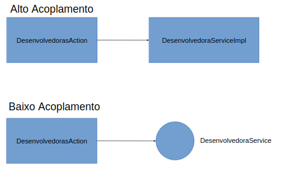

# Spring

O Spring é um framework que nos ajuda a não ter que lidar com algumas tarefas chatas e repetitivas:

#### Injeção de dependências

```java
private DesenvolvedoraService desenvolvedoraService = new DesenvolvedoraServiceImpl();
```

#### Criação do Entity Manager

```java
private static final EntityManagerFactory EMF = Persistence.createEntityManagerFactory("touch-games");
EntityManager em = EMF.createEntityManager();
```

#### Controle de transação

```java

em.getTransaction().begin();

em.persist(desenvolvedora);

em.getTransaction().commit();
```

#### Gerenciamento de Escopos
Às vezes queremos uma única instância para toda a aplicação

## Qual o problema do `new`?

Mesmo usando interfaces, ainda dependemos da implementação.



## Como fica um bean Spring?

```java
@Component
@Scope("singleton")
@Transactional
public class FabricanteServiceImpl implements FabricanteService {

    @PersistenceContext
    private EntityManager em;

    // ...

     // Quando não houver modificações de dados, use readOnly = true: melhor desempenho.
    @Transactional(readOnly = true)
    @Override
    public Fabricante recuperar(Long id) {
        return this.em.find(Fabricante.class, id);
    }

}
```

Injetando uma dependência

```java
@Component
@Scope("request")
public class FabricantesAction extends TWFActionSupport {

    @Autowired
    private FabricanteService fabricantesService;

}
```

Tipos de escopo:

- **singleton (padrão):** Uma instância para toda a aplicação
- **prototype:** Uma nova instância a cada `@Autowired`

Escopos WEB:
- **request:** Uma instância a cada **request**
- **session:** Uma instância a cada **sessão** do usuário

> #### Ative os listeners do Spring no `web.xml`

```xml
<context-param>
    <param-name>parentContextKey</param-name>
    <param-value>appContext</param-value>
</context-param>

<listener>
    <listener-class>org.springframework.web.context.ContextLoaderListener</listener-class>
</listener>
<listener>
    <listener-class>org.springframework.web.context.request.RequestContextListener</listener-class>
</listener>
```

> #### Diga ao Spring onde estão os beans web da aplicação
> Adicione o mapeamento abaixo ao arquivo `applicationContext.xml`

```xml
<context:component-scan base-package="br.com.touchtec.games.web" name-generator="br.com.touchtec.spring.FullQualifiedNameGenerator" />
```


> #### Diga ao Spring onde estão os beans core da aplicação
> Adicione o mapeamento abaixo ao arquivo `spring-config.xml`  
> O fato de termos dois arquivos para configurar beans Spring é uma herança histórica.  
> Não seria necessário fazer desta forma, mas fazer assim facilitou a migração do **EJB** para **Spring**.
  
```xml
<context:component-scan base-package="br.com.touchtec.games.web" name-generator="br.com.touchtec.spring.FullQualifiedNameGenerator" />
```


> #### Ainda no `spring-config.xml`
> Configure a factory do Entity Manager

```xml
<bean id="entityManagerFactory" class="org.springframework.orm.jpa.LocalEntityManagerFactoryBean"/>
```

> #### E o Gerenciador de Transações
> Também no `spring-config.xml`

```xml
<bean id="transactionManager" class="org.springframework.orm.jpa.JpaTransactionManager">
    <property name="entityManagerFactory" ref="entityManagerFactory" />
</bean>

<tx:annotation-driven transaction-manager="transactionManager" proxy-target-class="true" />
```

> #### Transforme `FabricanteServiceImpl` em um bean Spring
> Adicione as seguintes anotações

```java
@Component
@Scope("singleton")
@Transactional
public class FabricanteServiceImpl implements FabricanteService { }
```

> #### Injete o Entity Manager

```java
// equivalente ao @Autowired
@PersistenceContext
private EntityManager em;
```

> #### Marque os métodos de consulta como **readOnly**

```java
// Quando não houver modificações de dados, use readOnly = true: melhor desempenho.
@Transactional(readOnly = true)
@Override
public Fabricante recuperar(Long id) {}

@Transactional(readOnly = true)
public List<Fabricante> buscarTodos() {}
```

> #### Transforme `FabricanteAction` em um bean Spring
> Precisamos fazer isso para que possamos **injetar** FabricanteService  
> Repare que o escopo é **request**. Por quê?

```java
@Component
@Scope("request")
public class FabricantesAction extends TWFActionSupport { }
```

> #### Injete `FabricanteService`

```java
@Autowired
private FabricanteService fabricantesService;
```

> #### Reinicie a aplicação e acesse
> [/Fabricante.action]()  
> OS JSPs são semelhantes aos de **Desenvolvedora** e já foram implementados.

[Next [TWF]](TWF.md)

[Índice](index.md)
