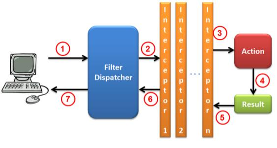

# Struts 2

Usar servlets para desenvolver uma aplicação completa é trabalhoso.  
Em vez disso, usamos _frameworks web_ para nos ajudar. O Struts é um deles.



## O que o Struts faz?

- Servlet → Action
- Filter → Interceptor
- web.xml → struts.xml
- Conversão de parâmetros
- Tratamento de Exceções
- Segurança

> #### Configure o Struts 2
> Adicione o Filtro do Struts no `web.xml`

```xml
<!-- Todas as nossas requisições que terminam com ".action" sao atendidas pelo struts -->
<filter>
    <filter-name>struts2</filter-name>
    <filter-class>org.apache.struts2.dispatcher.ng.filter.StrutsPrepareAndExecuteFilter</filter-class>
</filter>
<filter-mapping>
    <filter-name>struts2</filter-name>
    <url-pattern>*.action</url-pattern>
</filter-mapping>
```

> #### Abra a classe `HelloStrutsAction` e complete

```java
public class HelloStrutsAction extends TWFActionSupport {

    private static final long serialVersionUID = 1L;

    private String message = "Hello!";

    @Override
    public String execute() throws Exception {
        return SUCCESS;
    }

    public String goodbye() throws Exception {
        this.message = "Goodbye";
        return SUCCESS;
    }

    // getter é necessário para que o JSP consiga acessar: ${message}
    public String getMessage() {
        return this.message;
    }

    // setter é necessário para recuperar parâmetros da request
    public void setMessage(String message) {
        this.message = message;
    }

}

```

> #### Mapeie a action no `struts.xml`

```xml
<package name="struts" extends="twf-default" namespace="/struts">
    <action name="Hello" class="br.com.touchtec.games.web.struts.HelloStrutsAction">
        <result name="success">/jsp/struts/result.jsp</result>
    </action>
</package>
```

> #### Abre `jsp/struts/result.jsp` e adicione dentro da tag `<body>`

```html
<p>
    Eu sou retornado pela HelloStrutsAction.
</p>

<p>
    Eu consigo acessar variáveis diretamente da Action;
    Basta elas terem um getter.
</p>

<p>
    Por ex, consigo acessar o conteúdo de message: ${message}
</p>
```

> #### Suba a aplicação e acesse
> [Hello.action?message=Touch]()  
> Por padrão, o método da Action que é invocado é **execute**.  
> Para chamar outro método, use o operador **!**.

---

> #### Acesse a url abaixo para invocar o metodo goodbye
> [Hello!goodbye.action]()

# DesenvolvedorasAction

Vamos criar uma versão da tela de Desenvolvedoras utilizando Struts em vez
de Servlets.

## Implementando a tela inicial

> #### Implemente o método `execute()` da classe `DesenvolvedorasAction`
> Retornamos o nome do JSP

```java
private DesenvolvedoraService desenvolvedoraService = new DesenvolvedoraServiceImpl();

private List<Desenvolvedora> desenvolvedoras;

@Override
public String execute() throws Exception {
    this.desenvolvedoras = this.desenvolvedoraService.buscarTodos();
    return "jsp/admin/desenvolvedoras/list";
}

public List<Desenvolvedora> getDesenvolvedoras() {
    return this.desenvolvedoras;
}
```

> #### Preencha a página `jsp/admin/desenvolvedoras/list.jsp`
> Repare que não estamos usando tags HTML: usamos tags **TWF**.
> Vamos aprender mais sobre elas depois

```html
<t:userinterface>
    <t:title value="Deselvolvedoras"/>
    
    <t:panel id="list" cssClass="form" collapsible="true">
        <t:title value="Lista"/>
        
        <t:table list="%{desenvolvedoras}">
            <t:tablerowselector name="selectedId" multiple="false" property="id"/>
            <t:tablecolumn  property="nome" title="Nome"/>
        </t:table>
    
        <t:toolbar>
            <t:ajaxbutton action="Desenvolvedoras!create.action" responseTarget="response" successAction="$t('list').close()" template="create"/>
            <t:ajaxbutton action="Desenvolvedoras!update.action" responseTarget="response" successAction="$t('list').close()" template="update"/>
            <t:submitbutton action="Desenvolvedoras!remove.action" template="remove" confirmMsg="Deseja realmente exluir?"/>
        </t:toolbar>
    </t:panel>
    
    <div id="response"><!-- Atualizado por AJAX --></div>
</t:userinterface>
```

> #### Crie um mapeamento genérico para todas as actions
> Adicione o código abaixo ao `struts.xml`

```xml
<package name="default" extends="twf-default">
    <action name="*" class="br.com.touchtec.games.web.controller.{1}Action">
        <!-- Os results são retornados diretamente pelas Actions -->
    </action>
</package>
```

> #### Reinicie a aplicação e acesse
> [/Desenvolvedoras.action]()

## Implementando os formulários

> #### Implemente `create()`

```java
private String formTitle;

public String create() throws Exception {
    this.formTitle = "Criação";
    return "jsp/admin/desenvolvedoras/form";
}

public String getFormTitle() {
    return this.formTitle;
}
```

> #### E a página `jsp/admin/desenvolvedoras/form.jsp`

```html
<t:panel id="desenvolvedoraForm" cssClass="form">
    <t:title value="%{formTitle}"/>

    <input type="hidden" name="desenvolvedora.id" value="${desenvolvedora.id}"/>

    <t:field>
        <t:label value="Nome"/>
        <t:textinput name="desenvolvedora.nome" value="%{desenvolvedora.nome}"/>
    </t:field>

    <t:toolbar>
        <t:jsbutton template="cancel" action="$('desenvolvedoraForm').remove(); $t('list').open()"/>
        <t:submitbutton action="Desenvolvedoras!save.action" template="save" primary="true"/>
    </t:toolbar>
</t:panel>
```

> #### Continue preenchendo o método `update()`
> Repare que também usa `jsp/admin/desenvolvedoras/form.jsp`

```java
// Valor do <t:tablerowselector name="selectedId"> da lista
private Long selectedId;

// Para que form.jsp preencha a tela
private Desenvolvedora desenvolvedora;

public String update() throws Exception {
    this.desenvolvedora = this.desenvolvedoraService.recuperar(this.selectedId);
    this.formTitle = "Edição";
    return "jsp/admin/desenvolvedoras/form";
}

public Desenvolvedora getDesenvolvedora() {
    return this.desenvolvedora;
}

public void setDesenvolvedora(Desenvolvedora desenvolvedora) {
    this.desenvolvedora = desenvolvedora;
}

public Long getSelectedId() {
    return this.selectedId;
}

public void setSelectedId(Long selectedId) {
    this.selectedId = selectedId;
}
```

> #### E os métodos `save()` e `remove()`

```java
public String save() throws Exception {
    if (this.desenvolvedora.getId() != null) {
        this.desenvolvedoraService.editar(this.desenvolvedora);
        this.addSuccessMessage(this.desenvolvedora + " atualizada com sucesso");
    } else {
        this.desenvolvedoraService.criar(this.desenvolvedora);
        this.addSuccessMessage(this.desenvolvedora + " criada com sucesso");
    }
    return this.execute();
}

public String remove() throws Exception {
    this.desenvolvedora = this.desenvolvedoraService.recuperar(this.selectedId);
    this.desenvolvedoraService.remover(this.desenvolvedora);
    this.addSuccessMessage(this.desenvolvedora + " removida com sucesso");
    return this.execute();
}
```

> #### Reinicie a aplicação e acesse
> [/Desenvolvedoras.action]()
> Teste as operações implementadas
