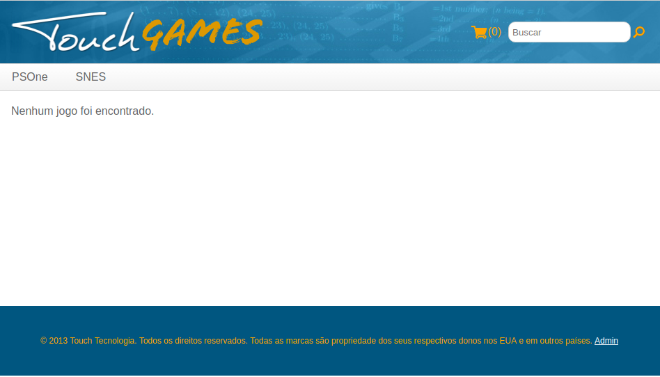

# Tags

#### Tela de Compras

Está na hora de criarmos o esqueleto do nosso e-commerce: a tela de Compras.

---

Assim como o html possui suas tags (`<div>`, `<span>`), podemos criar as nossas próprias em Java.  
Existem duas formas: 
- Criar uma TagLib [Tutorial no Confluence](http://confluence.touchtec.com.br/display/TWF/Desenvolvendo+Tags): classe **Java**.  
- Criar uma TagFile: arquivo `.tag`

TagLibs são mais complexas para criar, mas também mais robustas. O **TWFC** usa esta forma.   
TagFiles são bem mais simples e atendem boa partde das nossas necessidades.

# Tag Files

Para reaproveitar melhor nosos código, vamos usar uma ferramenta chamada **Tag Files**.  
Nossa tag file vai renderizar o esqueleto do nosso site:



> #### Complete o `<body>` do aquivo `WEB-INF/tags/screen.tag`
> `WEB-INF/lib` é o diretório padrão para criarmos tag files  
> `<jsp:doBody/>`: é onde será renderizado o **corpo** da tag (veremos adiante)

```html
<div id="screen">
    <div id="header">
        <jsp:include page="/WEB-INF/tags/header.jsp"/>
    </div>

    <div id="top-navigation">
        <jsp:include page="/WEB-INF/tags/menu_plataformas.jsp"/>
    </div>

    <!--CONTEUDO PASSADO NO CORPO DA TAG-->
    <div id="center">
        <jsp:doBody/>
    </div>

    <div id="footer">
        <jsp:include page="/WEB-INF/tags/footer.jsp"/>
    </div>
</div>
```

> #### Complete também `WEB-INF/tags/menu_plataformas.jsp`
> De onde vem `${todasPlataformas}`? Veremos adiante.  
> Veja que `menu_plataformas.jsp` é diferente dos demais jsps que vimos até aqui.  
> É apenas um outro tipo de sintaxe. São equivalentes.  

```html
<ul id="menu-plataformas" class="clearfix">
    <c:forEach items="${todasPlataformas}" var="plataforma">
        <li>
            <a href="${app}/Compras!jogosPorPlataforma.action?plataformaSelecionada.id=${plataforma.id}">${plataforma.nome}</a>
        </li>
    </c:forEach>
</ul>
```

> #### Abra `jogos_lista.jsp`
> Adicione a tag **screen** que acabamos de criar

```html
<g:screen>
    Teste
</g:screen>
```

> #### Reinicie a aplicação e acesse
> [/Compras.action]()  
> Já temos cabeçalho e rodapé.  
> Repare que o corpo da tag foi renderizado onde invocamos `<jsp:doBody/>`  

---

> #### Ainda em `jogos_lista.jsp`, adicione o conteúdo abaixo dentro da tag *screen*
> Remova o texto "Teste"

```html
<div id="jogos-lista">
    
    <c:forEach items="${jogos}" var="jogo">
        <a href="${app}/Compras!jogoDetalhes.action?jogoSelecionado.id=${jogo.id}">
            <div class="jogo">
                
                
                <div class="nome">
                    ${jogo.nome}
                </div>
                <div class="preco destaque">
                    <fmt:setLocale value="pt_BR"/>
                    <fmt:formatNumber type="currency" value="${jogo.precoComDesconto}" />
                </div>
            </div>
        </a>
    </c:forEach>
    
    <c:if test="${empty jogos}">
        <c:choose>
            <c:when test="${not empty nomeDoJogo}">
                Nenhum jogo foi encontrado para a busca "${nomeDoJogo}".
            </c:when>
            <c:when test="${not empty plataformaSelecionada}">
                Nenhum jogo foi encontrado para essa plataforma.
            </c:when>
            <c:otherwise>
                Nenhum jogo foi encontrado.
            </c:otherwise>
        </c:choose>
    </c:if>
</div>
```

> #### Recarregue a página (F5)
> [/Compras.action]()  
> Não está muito bonita nossa tela...


# NavigationInterceptor
TODO