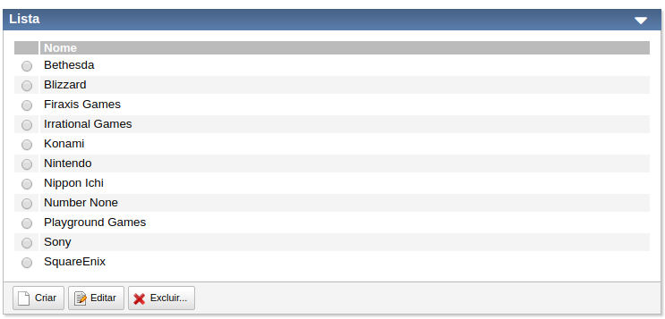
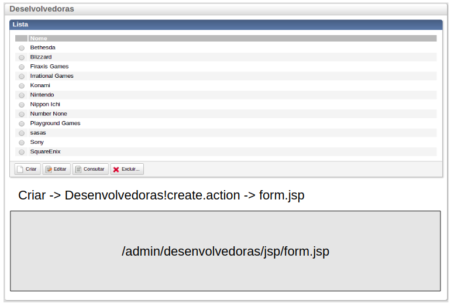

# TWF e TWFC

- _Touch Web Framework_: Extensões para Struts (Actions)
- _Touch Web Framework Components_: componentes visuais (taglibs)

## Motivações
- HTML é verboso
- HTML é repetitivo
- HTML não é reaproveitável


# O que são Tag Libs?

São equivalentes a tags HTML, mas _cutomizáveis_ e feitas em _Java_.
Também são chamdas de _componentes_.

Escrevemos isto:
```html
<t:panel>
    <t:table list="%{desenvolvedoras}">
    ...
    </t:table>
</t:panel>
```

É gerado isto:
```html
<div ttype="panel" class=”panel”>
    <div class=”content”>
        <table>
            <thead>
                <tr>
                    <th>...</th>
                </tr>
            </thead>
            <tbody>
                <tr>
                    <td>...</td>
                </tr>
                <tr>
                    <td>...</td>
                </tr>
            </tbody>
        </table>
    </div>
</div>
```

E depois isto:



# Showcase

É onde consultamos a documentação dos componentes do TWFC

> #### Acesse o showcase e navegue por algumas páginas
> [Showcase](http://showcase.touchtec.com.br:8080/twfc-showcase)

# Componentes principais
- User Interface
- Leiaute
    - panel, toolbar
    - tabbox
- Grid
    - table
- Formulário
    - field, label
    - textinput
    - numberinput
    - datepicker
    - singleselect
    - multipleselect
    - fileupload
- Botões
    - ajaxbuton
    - submitbutton
    - jsbutton

# Ajax

O TWFC fornece algumas facilidades para executar requests **AJAX**




```html
<t:ajaxbutton action="Desenvolvedoras!create.action" responseTarget="response" />

<div id="response"><!-- Atualizado por AJAX --></div>
```

> #### Suba a aplicação e acesse
> [/Fabricantes.action]()  
> Abra o **Chrome Dev Tools** (F12)  
> Aba Network  
> Aperte o botão Criar  
> Clique na request  **Fabricantes!create.action** e veja o **preview**: veja que apenas o trecho do formulário (e não a página inteira) é retornado.

# Usando o TWFC

Vamos implementar o cadastro de Jogos usando componentes do **TWFC**.  

## jogos/list.jsp

> #### Abra `jogos/list.jsp` e adicione o User Interface

```html
<t:userinterface>
    <t:title value="Jogos"/>
    
    <!-- panel -->
    
</t:userinterface>
```

> #### Acesse (não é necessário reiniciar a aplicação)
> [/Jogos.action]()

---

> #### Dentro do user interface, adicione um panel
> Repare que usamos dois tipos de botões: **ajaxbutton** e **submitbutton** 

```html
<t:panel id="list" collapsible="true">
    <t:title value="Lista"/>

    <!-- tabela -->   

    <t:toolbar>
        <t:ajaxbutton action="Jogos!create.action" responseTarget="response" successAction="$t('list').close()" template="create"/>
        
        <t:ajaxbutton action="Jogos!update.action" responseTarget="response" successAction="$t('list').close()" template="update"/>
        
        <t:ajaxbutton action="Jogos!view.action" responseTarget="response" successAction="$t('list').close()" template="view"/>
        
        <!-- usamos submit aqui apenas como exercício, poderia ser ajax também -->
        <t:submitbutton action="Jogos!remove.action" template="remove" confirmMsg="%{i18n.msg.remover}"/>
    </t:toolbar>
</t:panel>
```

> #### Recarregue a tela (não é preciso reiniciar a aplicação)
> Abra `JogosAction` e verifique os métodos referentes às actions dos botões
> Repare que o botão de Criar não funciona

---

> #### Logo abaixo do panel, adicione um `<div>` para a resposta do AJAX

```html
<div id="response"><!--  --></div>
```

> #### Recarregue e teste novamente o Criar

---

Por fim, adicione a tabela de jogos dentro do panel, acima da toolbar

```html
<t:table list="%{jogos}" var="jogo">
    <t:tablerowselector name="selectedId" multiple="false" property="id"/>

    <t:tablecolumn title="Imagem">
        
    </t:tablecolumn>

    <t:tablecolumn  property="nome" title="%{i18n.Jogo.nome}"/>

    <t:tablecolumn  property="genero" title="%{i18n.Jogo.genero}"/>

    <t:tablecolumn  property="desenvolvedora" title="%{i18n.Jogo.desenvolvedora}"/>

    <t:tablecolumn  title="%{i18n.Jogo.preco}">
        <fmt:formatNumber type="currency" value="${jogo.preco}" />
    </t:tablecolumn>

    <t:tablecolumn  title="%{i18n.Jogo.precoComDesconto}">
        <fmt:formatNumber type="currency" value="${jogo.precoComDesconto}" />
    </t:tablecolumn>

    <t:tablecolumn  title="%{i18n.Jogo.dataLancamento}">
        <fmt:formatDate value="${jogo.dataLancamento}" />
    </t:tablecolumn>
</t:table>
```

> #### Recarregue a tela
> Abra `JogosAction` e verifique como foi obtido `list="%{jogos}"`  
> O operador `%{}` é equivalente ao `${}`, mas é interpretado pelo TWFC  

---

> #### Selecione um item da tabela e tente Editar
> Repare que ocorre um erro  
> Precisamos indicar ao **ajaxbutton**, qual formulário ele deve submeter  
> Adicione `cssClass="form"` ao **panel**

```html
<t:panel id="list" collapsible="true" cssClass="form" >
...
```


---

> #### Alguns títulos da tabela estão com um **??** no nome. Falta carregar o arquivo de **i18n**. 
> Carregue o arquivo de i18n usando o componente **loadbundle**

```html
<t:loadbundle var="i18n" basename="Names" />

<t:userinterface>
...
```

> #### Recarregue a página

## jogos/form.jsp

> #### Abra `jogos/form.jsp` e adicione uma **Tabbox** dentro do **Panel**

```html
<t:panel id="jogoForm" cssClass="form">
    <t:title value="%{formTitle}"/>
    
    <t:tabbox>
        <t:tabpanel>
            <t:title>Geral</t:title>

        </t:tabpanel>

        <t:tabpanel>
            <t:title>Preço</t:title>


        </t:tabpanel>

        <t:tabpanel>
            <t:title>Imagens</t:title>


        </t:tabpanel>
    </t:tabbox>

</t:panel>
```

> #### Acesse
> [/Jogos.action]()   
> Use o botão **Criar** para abrir a tela de Criação

---

> #### No **TabPanel** Geral, adicione os campos abaixo
> Aqui, usamos vários componentes de Formulário. Observe o uso de cada um.  
> Observe que sempre que usamos `%{}`, há um objeto correspondente em `JogosAction`.

```html
<t:field>
    <t:label value="%{i18n.Jogo.nome}"/>

    <t:textinput name="jogo.nome" value="%{jogo.nome}">
        <t:validate criteria="required" />
    </t:textinput>
</t:field>

<t:field>
    <t:label value="%{i18n.Jogo.descricao}"/>

    <t:textinput template="textarea" name="jogo.descricao" value="%{jogo.descricao}"/>
</t:field>

<t:field>
    <t:label value="%{i18n.Jogo.genero}"/>

    <t:singleselect template="radio-horizontal"
                    name="jogo.genero" 
                    value="%{jogo.genero}"
                    enumList="br.com.touchtec.games.core.model.Genero"/>
</t:field>

<t:field>
    <t:label value="%{i18n.Jogo.desenvolvedora}"/>

    <t:singleselect name="jogo.desenvolvedora.id" 
                    value="%{jogo.desenvolvedora}"
                    list="%{desenvolvedoras}" 
                    optionLabel="nome"  
                    optionValue="id">
        <t:validate criteria="required" />
    </t:singleselect>
</t:field>

<t:field>
    <t:label value="%{i18n.Jogo.plataformas}"/>

    <t:multipleselect name="jogo.plataformas" 
                      optionValueName="id" 
                      value="%{jogo.plataformas}"
                      list="%{plataformas}" 
                      optionLabel="nome" 
                      optionValue="id" />
</t:field>

<t:field>
    <t:label value="%{i18n.Jogo.dataLancamento}"/>

    <t:datepicker name="jogo.dataLancamento" value="%{jogo.dataLancamento}"/>
</t:field>
```

> #### Aperte novamente o botão **Criar**. Não é necessário recarregar a tla inteira.

---

> #### Complete o Panel de Preço

```html
<t:field>
    <t:label value="%{i18n.Jogo.preco}"/>

    <t:textinput name="jogo.preco" value="%{jogo.preco}">
        <t:mask mask="99,999.999.999.999" type="reverse" />
    </t:textinput>
</t:field>

<t:field>
    <t:label value="%{i18n.Jogo.desconto}"/>

    <t:numberinput name="jogo.desconto" value="%{jogo.desconto}"/>%
</t:field>
```

> #### e o Panel de Imagens

```html
<c:forEach begin="0" end="4" var="index">
    <t:field>
        <t:label>Imagem ${index + 1}</t:label>

        <t:fileupload style="vertical-align: top" name="imagens[${index}]" />

        <c:if test="${jogo.imagens[index] != null}">
            
        </c:if>
    </t:field>
</c:forEach>
```

> #### Aperte o Criar para recarregar

---

> #### Os labels estão desalinhados
> Use o componente **set** para adicionar uma largura a todos os labels
 
```html
<t:panel id="jogoForm" cssClass="form">
    <t:title value="%{formTitle}"/>
    
    <t:set component="label" property="style" value="width:150px" />
    
    ...
```

> #### Por fim, adicione a **toolbar** ao **panel**
> Repare no uso do **jsbutton**: `$('jogoForm').remove()` e `$t('list').open()`

```html
...
    <t:toolbar>
        <input type="hidden" name="jogo.id" value="${jogo.id}"/>

        <t:jsbutton template="cancel" action="$('jogoForm').remove(); $t('list').open()"/>

        <t:submitbutton action="Jogos!save.action" template="save" primary="true"/>
    </t:toolbar>
</t:panel>
```

> #### Aperte o Criar para recarregar

[Next [Tags]](TAGS.md)

[Índice](index.md)
